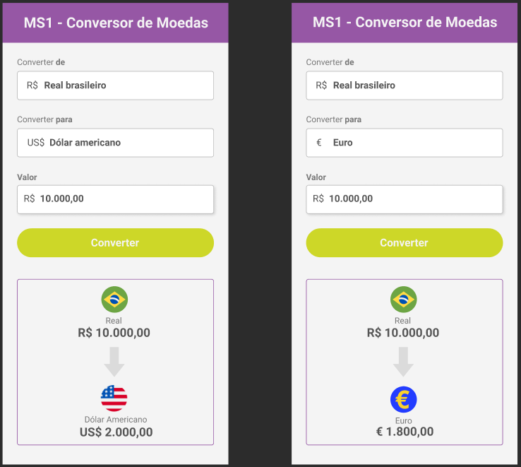

# Conversor de Moedas

> Conversor feito durante um evento do Code Club.

### Ajustes e melhorias

O projeto ainda está em desenvolvimento e as próximas atualizações serão voltadas nas seguintes tarefas:

- [x] Uso de HTMl
- [x] Uso de CSS
- [x] Uso de JavaScript

## 🤝 Colaboradores

Agradecemos às seguintes pessoas que contribuíram para este projeto:

<table>
  <tr>
    <td align="center">
      <a href="https://www.linkedin.com/in/natanael-evangelista-martins-792777223/">
         
        
          <b>Natanael</b>
        
      </a>
    </td>
    
  </tr>
</table>

## 😄 Seja um dos contribuidores 

Quer fazer parte desse projeto? Clique [AQUI](CONTRIBUTING.md) e leia como contribuir.

[⬆ Voltar ao topo](#Conversor-de-Moedas) 
